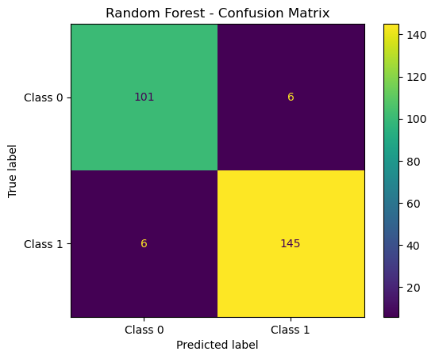

# Musical Chord Classifier
---


## Project Overview
This project aims to classify musical chords using various machine learning models, including a Convolutional Neural Network (CNN). The dataset consists of features extracted from audio files, representing different musical chords.

--- 
## Spectogram Analysis of a Signal


---
## Dataset
The dataset consist of major and minor chords stored as audio files 
([Download Dataset](https://www.kaggle.com/datasets/deepcontractor/musical-instrument-chord-classification/data))

---
## Data Preprocessing
- Harmonic features were extracted from audio data using Fourier Transform.
- The dataset was standardized for uniform feature scaling.

### Harmonic Frequencies


---
## Feature Engineering
- Harmonic intervals between successive harmonics and between harmonics and the first harmonic were calculated.

## Models
- Various models were trained, including Logistic Regression, K-Neighbors Classifier, Decision Tree, Random Forest.
- Hyperparameter tuning was performed to optimize model performance. The Random Forest Classifer was the top performing model; therefore, we only performed a hyperparamter tuning on it.
- Out of curiosity, we also developed a CNN (deep learning model) to see how well it would perform

---
## Results
- The Random Forest Classifier perofrmed (95%) slightly better the CNN (94.6%)

### Confusion Matrix


---
### ROC


---
## Setup and Installation
1. Clone the repository:
   ```bash
   git clone https://github.com/khaledalrashid1/musical-chord-classification.git
   cd musical-chord-classification
